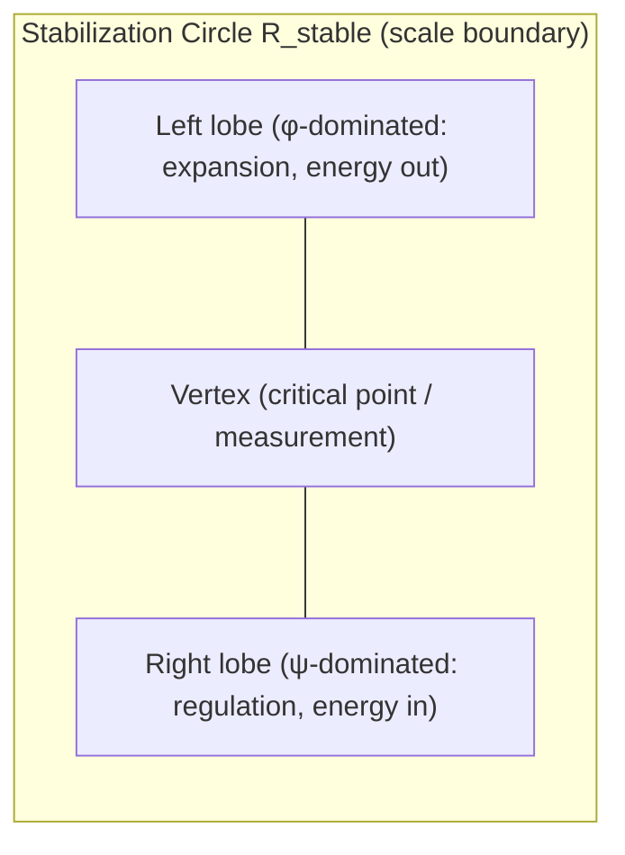
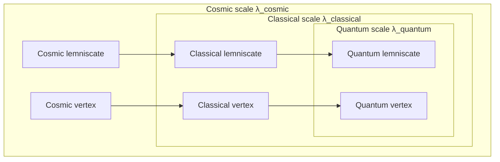
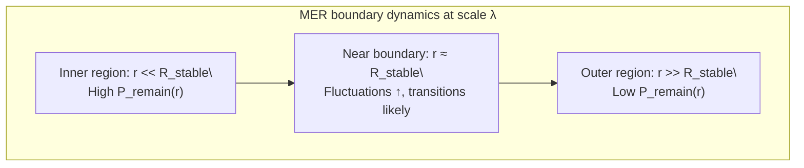
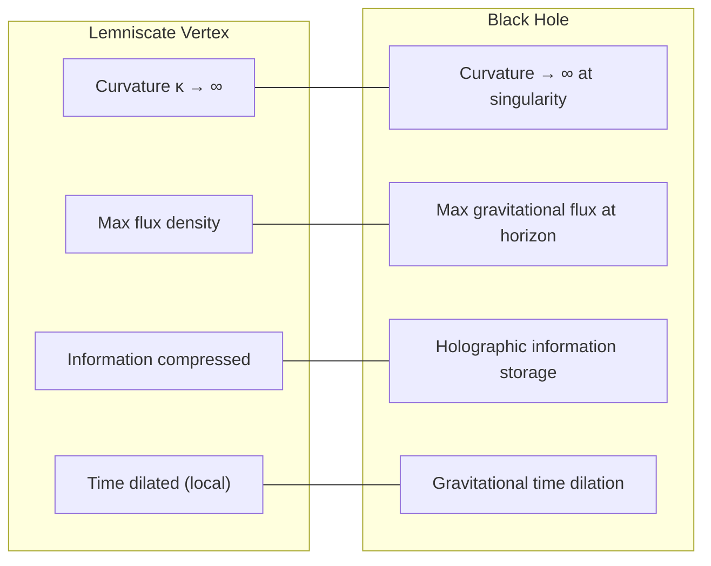
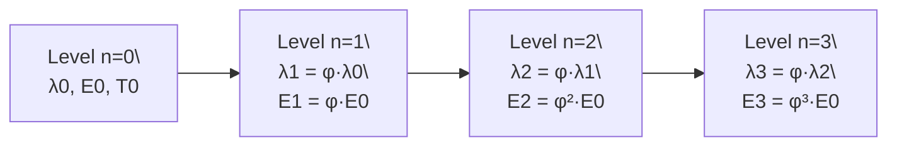
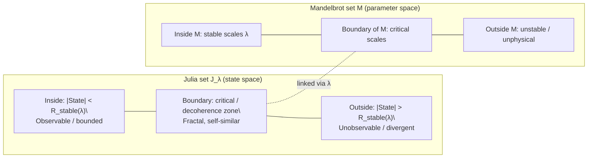
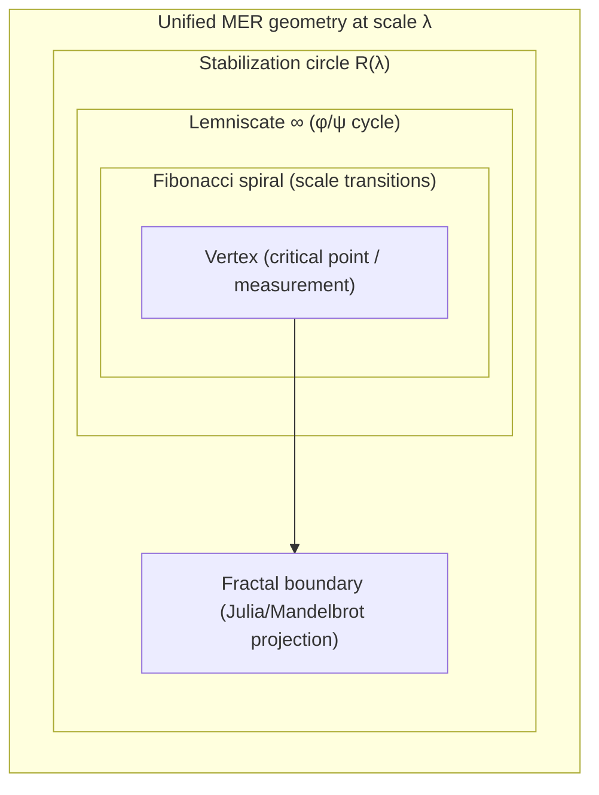

# Section 4 Diagrams: Geometrical Structure and Visualization

This document contains Mermaid diagram definitions for the key MER geometric structures described in Section 4.

---

## 1. Base MER Lemniscate and Stabilization Circle

---

## 2. Multi-Scale Lemniscate Nesting

---

## 3. Boundary and Transition Regions

---

## 4. Vertex–Black Hole Analogy

---

## 5. Fibonacci Spiral Scale Levels

---

## 6. Fractal Boundary and Stable Scales

---

## 7. Unified MER Geometry Diagram

